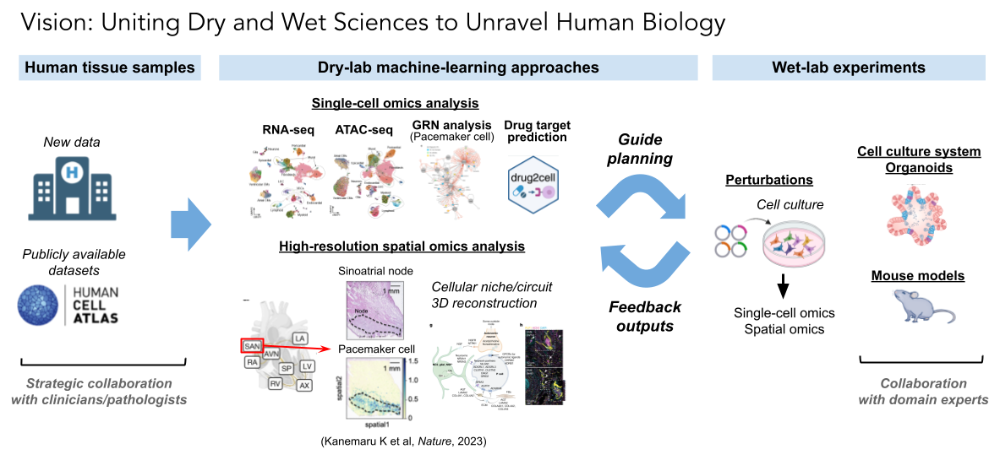

 
# Brief history
<b><i>Doctoral course, First post-doc</b></i> 
I completed my medical degree in 2012 and PhD in 2016 at the University of Tsukuba, Japan. 
During my PhD and initial post-doc, I focused on the functional analysis of immunoreceptors using mouse models and cellular assays at [Akira Shibuya Lab](http://immuno-tsukuba.com/english/index.html). This includes extensive experience in **wet-lab techniques**, such as molecular biologies, cell cultures, animal models, and immune response studies (Kanemaru K et al., <b><i>Science Immunology</i></b>, 2019). 
<b><i>Second post-doc</b></i> 
Since October 2020, at the [Sarah Teichmann Lab](https://www.teichlab.org/), I have been focusing on data generation/analysis of the human heart using **single-cell and spatial multiomics technologies**. I expanded my expertise towards a combination of wet-lab and dry-lab work: leveraging machine learning approaches and using cutting-edge genomics technologies to answer our biological questions and at the same time, advance method development in single-cell and spatial transcriptomics. This allowed me to obtain biological insights directly from <i>in vivo</i> human tissues, and I was able to discover new cellular niches in the human heart (Kanemaru K and Cranley J et al., <b><i>Nature</i></b>, 2023).

My publications are [here](https://kazukane.github.io/publications/)

# Vision
I am passionate about translating computational insights into practical applications within wet lab systems, where I can validate and further explore molecular mechanisms. My vision is to develop a powerful platform that seamlessly connects data analysis with experimental biology, enabling the rigorous testing of hypotheses derived from human data. 

This integrative approach will enhance our understanding of human biology and propel my career toward leading innovative, high-impact research.

# Research Interest
  - Multiomics analysis
  - Cardiology
  - Immunology

# News
